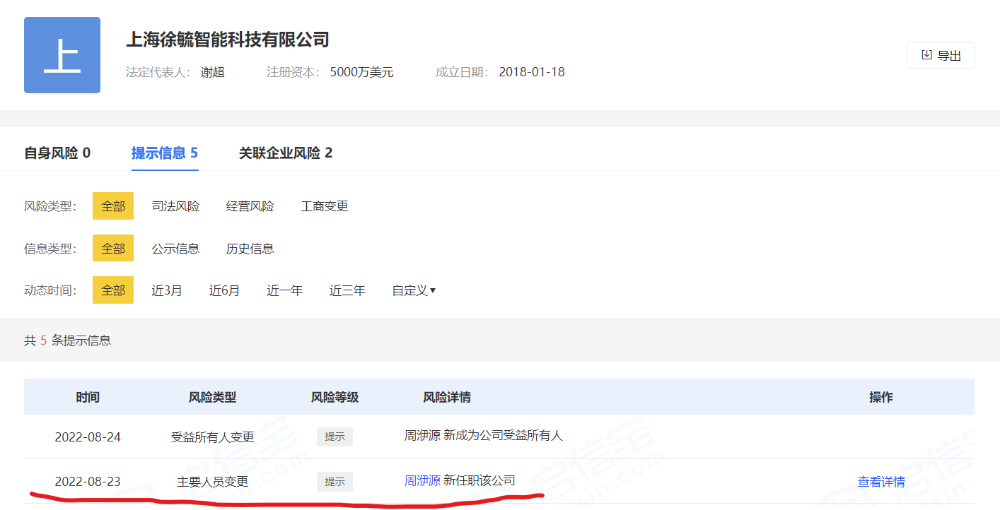

# zilliz 局中局

如果你了解过 zilliz 这家公司，接触过谢超（花名：星爵）这个人，你多半会觉得这家公司有种诡异的气质。简单说就是不对劲！

## 迷雾重重的公司

### 突然的转型

zilliz 是一家 2017 年就成立的公司。这个公司的核心是一个创始人（谢超），加上两三个他的铁杆，团队看起来很一般，在业界没有深厚的积累。

最初，zilliz 在折腾一个 GPU 数据库项目，看不出显著进展。到了 2019 年 zilliz 突然搞起了向量数据库，一个新产品，居然有点声色。这出乎了不少人的意料。因为早期的 GPU 数据库和后来的向量数据库，背后的业务逻辑和技术完全不同。很难相信 zilliz 是从 GPU 数据库项目中积累了经验，得到了成长。

### 打死不做商业化

2021 年 zilliz 出来做融资路演的时候，谢超信誓旦旦说向量数据库 1.0 版本取得了如何优秀的成绩，广受开发者好评。但当我问到何时能开始商业化时，他却告诉我产品要重构，要先把技术做到极致再考虑商业化。这个说法很奇怪，如果向量数据库 1.0 版本真的这么优秀，为什么不能商业化？再说重构是技术层面的，商业化是业务层面，这两个事情不矛盾。

就在一年前，2020 年 zilliz 出来融资的时候大吹特吹向量数据库，仿佛商业化就在眼前，结果忽悠了一把投资人。拿到钱以后又说要开始重构产品。至此，虽然 zilliz 构建了第一个向量数据库产品，发展阶段比竞品一度领先 1 年半，但是 zilliz 却因为迟迟没有对向量数据库产品进行商业化，目前反而落后了主要竞争对手 Pinecone 至少 1 年半。所以 zilliz 在向量数据库上的能力究竟如何？

### 频繁变动的团队

zilliz 的高管团队变动宛如走马灯一样频繁。虽然创业公司的人员流动性通常都比较高，但在高管层面一般会相对稳定，因为创业公司的高管薪资有相当部分是期权，在创业初期期权基本没有变现的可能性。

尤其其中两个人的离开颇为不同寻常，一个是 zilliz 早期技术合伙人，向量数据库 1.0 的负责人。关于他的离开，脉脉上有各种传闻。另一个是 zilliz 的社区合伙人，此人之前一直对外代表 zilliz 的形象，走的非常突然，据说他的期权都作废了。

### 真假富二代

虽然 zilliz 一分钱没赚，但不妨碍谢超买法拉利，买游艇，买两套豪宅，泡自家女员工。尽管谢超一直在立富二代人设，但找他之前的大学同学，美国留学时的同学稍加了解就可以知道他的底细。这个富二代人设，完全禁不起稍微 DD 一下。更何况，买这些东西的时间为什么都是在 B 轮和 B+ 轮合计融资 1 亿美元之后呢？

诸如此类的奇怪事情还有 很多，不得不让人提高警惕，但一时没什么证据。直到————

## 神秘女高管出现

2022 年 8 月 23 日，zilliz 的国内实体突然进行了工商变更，新增了一名不持股的高管————
周洢源。

此何许人？我之前接触 zilliz 从没听过有这么一号人。习惯性的在领英上搜了下这个名字，好家伙：

这位周女士竟然在 2018 年就已经在 zilliz 工作。我找人多方打听了解到，这位周女士曾经是谢超的总裁助理，后于 2018 年初离职。

为什么一个 2018 年离职的员工，会在 4 年后以高管身份进入 zilliz 的工商信息？？实在是匪夷所思，如果是想进行利益输送，难道不应该暗地里进行吗？何必搞得如此高调？

带着这个疑问，我们做了进一步的挖掘。在得到了更多的信息碎片后，整件事拼凑起来的模糊样子，让人不安。

## zilliz 的隐秘时间线

- 2018/03，**周洢源**从 zilliz 离职
- 2019/04/10，**周洢源**成立“[上海乘欢文化发展中心](https://www.qixin.com/company/f3ca2f7b-6512-4069-b44b-92dfb5238c3f?key=%E4%B8%8A%E6%B5%B7%E4%B9%98%E6%AC%A2%E6%96%87%E5%8C%96%E5%8F%91%E5%B1%95%E4%B8%AD%E5%BF%83)”（91310230MA1JT79W2E）
- 2020/04/27，**周洢源**将乘欢文化转让给他人（段波）
- 2020/05~10，zilliz 进行 B 轮融资
- 2020/11，zilliz 完成 B 轮融资（[36氪独家|「Zilliz」获4300万美金全球开源基础软件最大单笔B轮融资](https://www.36kr.com/p/964817541848841)）
- 2020/12/04，**周洢源**成立“[上海圆圆脸电子商务有限公司](https://www.qixin.com/company/446f7fab-f261-46ab-9b19-a4c7fb5db384)”（91310120MA1J049M4R）
- 2021/02，**谢超**与**施靓莹**（zilliz HR）奉子成婚
- 2021/05~10，zilliz 进行 B+ 轮融资
- 2021/12，zilliz 完成 B+ 轮融资
- 2021/12/24，**施靓莹**成立“[上海米五思信息科技有限公司](https://www.qixin.com/company/3b97fca3-645d-11ec-b5dc-83cf331ae46e)”（91310110MA7G7C777R）
- 2022/08/23，**周洢源**成为 zilliz（[上海徐毓智能科技](https://www.qixin.com/company/26e50a8f-57db-422e-a6fb-890309973114)）高管
- 2023/03/17，**施靓莹**注销“上海米五思信息科技有限公司”
- 2023/04/24，“上海乘欢文化发展中心”被注销

要说这星爵套路真是玩得溜。从上面的时间线，可以很清晰的看到：

1. 每次融资前，他都会清理掉关联公司。比如，2020/04/27，2023/03/17，2023/04/24。
2. 每次融资完成后，他都搞了新的关联公司，比如，2020/12/04，2021/12/24。

很难解释为什么暗地里和谢超合作紧密的周洢源会突然浮出水面，进入 zilliz 的工商信息。这里有两个问题：

首先，为什么周要进入工商信息却又不占股？利益输送完全不需要做的这么明显。听闻谢很喜欢泡女员工,他认识周在前，却和后面相识的施结了婚。想必周这是在宣示主权。

其次，为什么谢超要答应这样的要求？从理性角度来看，绝不应该暴露这样的关系。但却最终答应了，也许周有让谢超无法拒绝的东西。同时，B+ 轮 zilliz 只能找到中东投资人，估计谢超做决策的时候认为 zilliz 不可能在国内继续融资了。

只是，谢超去到美国并未能获得硅谷投资人的认可（还是老外冷静啊）。大模型之后 zilliz 的美国对手彻底起飞了。zilliz 的后续融资估计还得依赖国内的机构。这就很尴尬了……

不知道下个入局 zilliz 的机构又会是谁呢？
